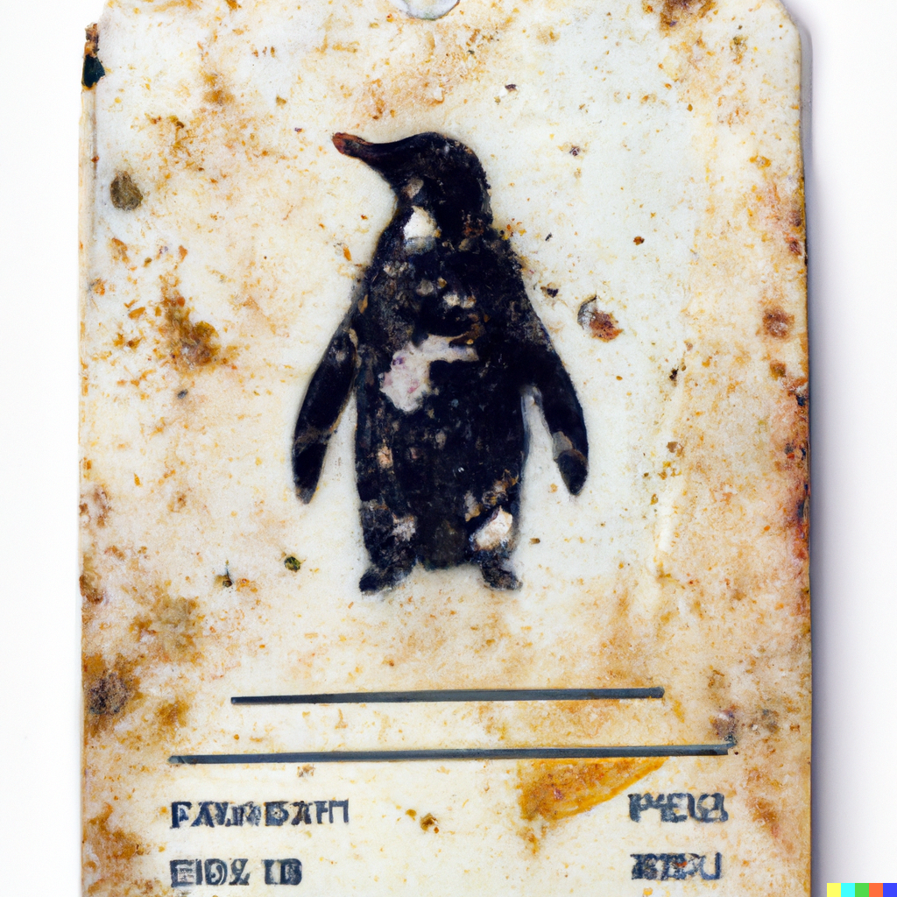

# DirtyCred

DirtyCred is a kernel exploitation concept that swaps unprivileged [kernel credentials](https://www.kernel.org/doc/Documentation/security/credentials.txt) with privileged ones to escalate privilege. Instead of overwriting any critical data fields on kernel heap, DirtyCred abuses the heap memory reuse mechanism to get privileged. Although the concept is simple, it is effective. See the [Blackhat presentation](https://zplin.me/papers/DirtyCred-Zhenpeng.pdf) or [CCS paper](https://zplin.me/papers/DirtyCred.pdf) for more details.



## Exploitation effects

**Data-only**: no need to bypass KASLR or leak kernel heap

**Universal**: the exploits written would work across different kernels and architectures.

**Effective**: bypass all the available exploit mitigation in upstream kernel.

## Demo
[CVE-2021-4154](https://github.com/Markakd/CVE-2021-4154)

[CVE-2022-2588](https://github.com/Markakd/CVE-2022-2588)

some others to be coming...

## Defense

See the code [here](./defense).

## Publication

[Blackhat USA 2022](https://zplin.me/papers/DirtyCred-Zhenpeng.pdf)

[CCS 2022](https://zplin.me/papers/DirtyCred.pdf)

## Online Resource

We provide two VMs for testing [CVE-2022-2588](https://github.com/Markakd/CVE-2022-2588). Each connection to the VM has 10 minitues timeout (i.e. the VM will be shutdown after being connected for 10 minitues). Each connection will get a fresh VM, everything stored before will be reset. When accessing the VM, please login the system with `low` user whose password is `low`. Please compile the exploit code then launch the attack.

### How to connect to VMs

**Please login with user `low` and password `low`**

**Ubuntu 20**
```
socat FILE:`tty`,raw,echo=0 TCP:150.136.171.117:1337
```

**Centos 8**
```
socat FILE:`tty`,raw,echo=0 TCP:150.136.171.117:1338
```

## Acknowledgment

This research was done with the help of [Yuhang Wu](https://twitter.com/wupco1996) and [Xinyu Xing](https://twitter.com/xingxinyu). Thanks [Eduardo Vela](https://twitter.com/sirdarckcat) for providing this amazing logo.

